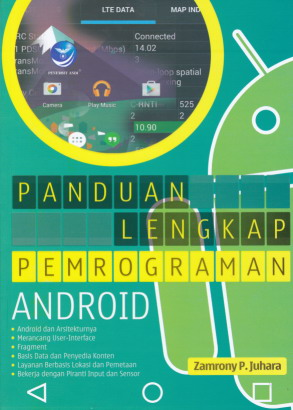
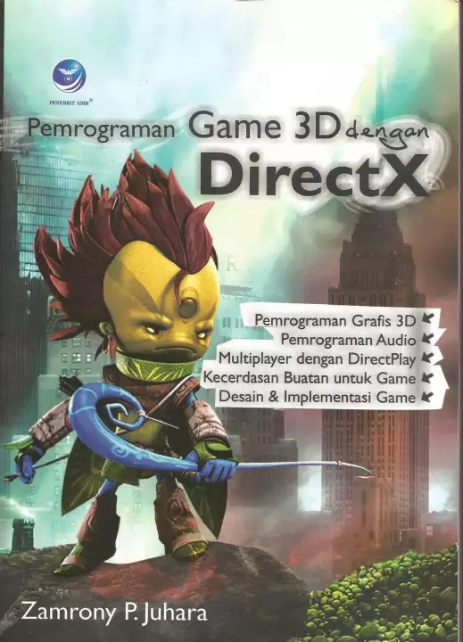

# Hi I am Zamrony 👋

I am software developer who has interest web development, database and game development. [My online resume](https://zamronypj.github.io) if you want to hire me.

- 🔭 I’m currently working on my personal project [Fano Framework](https://fanoframework.github.io), a web framework written with [Free Pascal](https://freepascal.org).
- 🌱 I’m currently learning anything that interest me.
- 🤔 I’m looking for help with Fano Framework

## My books

### Panduan Lengkap Pemrograman Android

Android programming book that explains various topics from getting started, creating basic layout view, store data in shared preferences and database operation with SQLite to more advanced topics such as working with 3D graphics with OpenGL ES, custom view, working with Bluetooth etc.

### Pemrograman Game 3D dengan DirectX

DirectX programming book that discusses from getting started with DirectX components, working with 3D graphics with Direct3D such as rendering 3D primitives. Reading game input device such keyboard, mouse, gamepad and joystick using DirectInput. Audio programming to play multiple sound effects and game music with DirectSound. Also discuss network programming with DirectPlay. Book also discusses terrain rendering and fog and shader programming.

